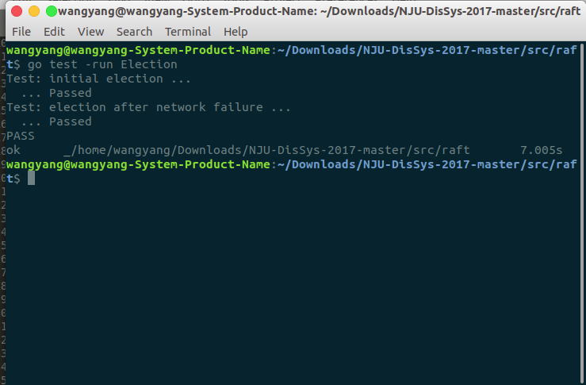

### Assignment 1

#### 1 整体框架

##### 1.1 状态

每个server持有一个Raft结构作为状态机，每个server功能一样，但有三种不同的状态：
 + Follower
 + Candidate
 + Leader


##### 1.2 RPC

他们通过两种RPC进行通信


+ Candidate请求投票的RequestVote
+ Leader对节点进行管理的AppendEntries，在选举中，只需要考虑AppendEntriesArgs中entries为空的heartbeat


##### 1.3 Timeout

分别由两个duration控制：


+ 控制选举的electionTimeout（随机）
+ 定时发送appendEntries的heartbeatInterval（固定）


#####　1.4 业务逻辑

对于不同状态的Raft节点，其行为逻辑为：

+ Follower

	+ 处理收到的appendEntries请求和requestVot请求，重置electionTimeout
	+ electionTimeout超时后转为Candidate发起选举

+ Candidate
	+ 处理收到的appendEntries请求，重置electionTimeout
	+ 处理收到的requestVote请求，不重置electionTimeout
	+ electtionTimeout超时重新发起选举
+ Leader
	+ 定时广播appendEntries

注意，对于所有servers，如果自己的任期小于收到的RPC请求中参数的任期，都要更新自己的任期，并转换为Follower


#### 2 具体实现

##### 2.1 Raft结构

在补全论文figure 2所需成员外，还添加了三个通信通道和三个管理时间

```go
type Raft struct {
	mu        	sync.Mutex
	peers     	[]*labrpc.ClientEnd
	persister 	*Persister
	me 			int // index into peers[]
	
	state       int
	voteCount   int

	//persistent
	votedFor	int
	currentTerm	int
	log 		[]Entry//first index is 1

	//volatile
	commitIndex	int//已知的最大的已经被提交的日志条目的索引值
	lastApplied	int//最后被应用到状态机的日志条目索引值（初始化为 0，持续递增）

	//leader only
	nextIndex	[]int//对于每一个服务器，需要发送给他的下一个日志条目的索引值（初始化为领导人最后索引值加一）
	matchIndex	[]int//对于每一个服务器，已经复制给他的日志的最高索引值

	voteCh		chan bool//投票信息接受通道
	appendCh	chan bool//管理信息接收通道
	applyCh     chan ApplyMsg
	electionTimer*		time.Timer//electionTimeout计时器
	electionTimeout		time.Duration
	heartbeatInterval	time.Duration


}
```


##### 2.2 Make()

Make函数的实现：raft成员初始化后，使用go关键字创建一个新的goroutine激活该server

```go
func Make(peers []*labrpc.ClientEnd, me int, persister *Persister, applyCh chan ApplyMsg) *Raft {
	rf := &Raft{}
	rf.peers = peers
	rf.persister = persister
	rf.me = me

	rf.state = Follower
    rf.voteCount = 0

	rf.votedFor = -1
	rf.currentTerm = 0
	rf.log = make([]Entry, 0)
	rf.log = append(rf.log, Entry{})

	rf.commitIndex = 0
	rf.lastApplied = 0
	
	rf.voteCh = make(chan bool, 1)
	rf.appendCh = make(chan bool, 1)
	rf.applyCh = applyCh

	rf.randomElectionTime()//生成随机的electionTime
	rf.heartbeatInterval = time.Duration(HEARTBEAT) * time.Millisecond//初始化固定的heartbetInterval

	rf.readPersist(persister.ReadRaftState())

	go rf.acivate()

	return rf
}
```


##### 2.3 activate()

activate函数中，执行无限循环，判断当前raft结点的状态，实现上文1.4所述的重置时间等业务逻辑：

```go
func (rf *Raft) activate( ){
	for {
		rf.mu.Lock()
		st := rf.state
		rf.mu.Unlock()
		switch st {
		case Follower:
			select{
			case <-rf.appendCh:
				rf.electionTimer.Reset(rf.electionTimeout)
			case <-rf.voteCh:
				rf.electionTimer.Reset(rf.electionTimeout)
			case <-rf.electionTimer.C:
				rf.mu.Lock()
				rf.updateTo(Candidate)
				rf.startElection()
				rf.mu.Unlock()
			}
		case Candidate:
			select {
			case <-rf.appendCh:
				rf.electionTimer.Reset(rf.electionTimeout)
				rf.mu.Lock()
				rf.updateTo(Follower)
				rf.mu.Unlock()
			case <-rf.voteCh:
			case <-rf.electionTimer.C:
				rf.mu.Lock()
				rf.startElection()
				rf.mu.Unlock()
			}
		case Leader:
			rf.startAppend()
			time.Sleep(rf.heartbeatInterval)
		}
	}
}
```


##### 2.4 startElection()

对于startElection，首先自增任期，投票给自己，然后生成新的electionTimeout，之后构建参数（只用到了Term和CandidateId两个参数）并为回复分配空间，遍历peers，对所有其他节点创建新的goroutine广播RequestVote请求，如果收到超过半数的投票，则赢得选举成为leader，否则要么发现自己任期过时退回followers要么activate的goroutine中electionTimeout超时重新开始选举。

```go
func (rf *Raft) startElection() {
	rf.currentTerm += 1
	rf.votedFor = rf.me		//vote for self
	rf.voteCount = 1
	rf.randomElectionTime()

	args := RequestVoteArgs{
		rf.currentTerm,
		rf.me,
		rf.getLastLogIndex(),
		rf.getLastLogTerm(),
	}	

	reply := &RequestVoteReply{}
	
	for i, _ := range rf.peers {
		if i != rf.me {
			go func(server int) {
			//	fmt.Printf("raft%v is sending RequestVote RPC to raft%v\n", rf.me, server)
				if rf.state == Candidate && rf.sendRequestVote(server, args, reply){
					if reply.VoteGranted {
						rf.mu.Lock()
						defer rf.mu.Unlock()
						rf.voteCount += 1
						if rf.voteCount > len(rf.peers)/2{
							rf.updateTo(Leader)
							return
						}
					} else if reply.Term > rf.currentTerm{
						rf.mu.Lock()
						rf.currentTerm = reply.Term
						rf.updateTo(Follower)
						rf.mu.Unlock()
						return						
					}
				} 
			}(i)
		}
	}
}
```


##### 2.5 startAppend()

对于startAppend，本次作业实现了一个简单的广播逻辑，构建参数（仅用到Term和LeaderId）并为回复分配空间，遍历peers，对所有其他节点创建新的goroutine广播AppendEntries请求作为heartbeat，如果回复的任期更新，则说明该leader已过期，将转为Follower

```go
func(rf *Raft) startAppend(){

	args := AppendEntriesArgs{
		rf.currentTerm,
		rf.me,
	}
	reply := AppendEntriesReply{}

	for i, _ := range rf.peers {
				if i != rf.me {
					go func(server int) {
						rf.sendAppendEntries(server, args, &reply)
						if reply.Term > rf.currentTerm {
							rf.mu.Lock()
							rf.currentTerm = reply.Term
							rf.updateTo(Follower)
							rf.mu.Unlock()
						}
					}(i)
				}
			}

}
```

##### 2.6 RPC

具体的RPC请求的实现细节见函数RequestVote()与AppendEntries()的注释:

```go
func (rf *Raft) RequestVote(args RequestVoteArgs, reply *RequestVoteReply) {
	// Your code here.
	rf.mu.Lock()
	defer rf.persist()
	defer dropAndSet(rf.voteCh)//通知当前节点被调用
	defer rf.mu.Unlock()

	//比较候选人任期是否过时
	if  args.Term < rf.currentTerm{
		reply.Term = rf.currentTerm
		reply.VoteGranted =false
		return
	}
	
	//如果候选人任期比当前节点新，则当前节点转为跟随者，投票给候选人
	if  args.Term > rf.currentTerm {
		rf.currentTerm = args.Term
		rf.updateTo(Follower)
		rf.votedFor = args.CandidateId
		reply.Term = args.Term
		reply.VoteGranted = (rf.votedFor == args.CandidateId)

		return
	}

	//如果候选人和当前节点任期一样
	if  args.Term == rf.currentTerm {
		if rf.votedFor == -1 || rf.votedFor == args.CandidateId {		
				rf.votedFor = args.CandidateId
		}
		reply.Term = args.Term
		reply.VoteGranted = (rf.votedFor == args.CandidateId)
		return
	}

}
```

```go
func (rf *Raft) AppendEntries(args AppendEntriesArgs, reply *AppendEntriesReply) {
	rf.mu.Lock()
	defer rf.persist()
	defer dropAndSet(rf.appendCh)//通知当前节点被调用
    defer rf.mu.Unlock()
	
    //如果当前节点任期大于领导，那么返回false和当前任期
	if args.Term < rf.currentTerm{
		reply.Success = false
		reply.Term = rf.currentTerm
	} else if args.Term > rf.currentTerm{//如果当前节点任期小于领导，更新任期，转为跟随者
		rf.updateTo(Follower)
		rf.currentTerm = args.Term
		reply.Term = args.Term
		reply.Success = true
	} else{//相等 则只返回true
		reply.Success = true
	}	

}
```


#### 3 实验结果

起初，第一个测试passed但是warning没有failure的时候term改变，后来修改了selectionTime就都通过了



#### 4 总结

需要看懂论文和要求

细节不要要求一步到位，从最简单的开始尝试

不懂的马上查

充分利用网上资源