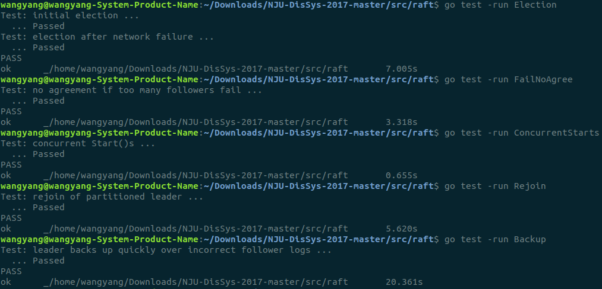
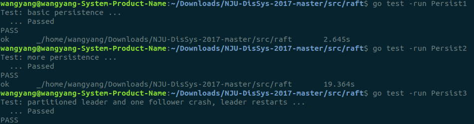

### Assignment 2

#### 1 Overview

本次实验主要实现的是log的复制，主要由三个步骤：

+ 外界通过start()向leader传入一条log
+ leader通过appendEntries()向其他节点广播并实现复制
+ 复制成功的log通过applyCh传递给外界

####  2 Part Ⅰ

##### 2.1 Start()

外界通过调用Start()函数传入log，通过GetState函数确认若为leader，则将传入的log添加到leader的日志中

```go
func (rf *Raft) GetState() (int, bool) {
	term := rf.currentTerm
	isleader := false
	if rf.state == LEADER{
		isleader = true
	}
	return term, isleader
}
//外界传入日志
func (rf *Raft) Start(command interface{}) (int, int, bool) {
	rf.mu.Lock()
	defer rf.mu.Unlock()
	index := -1
	term := 1
	isLeader := false	
	term,isLeader = rf.GetState()
	if isLeader{
		index = rf.getLastLogIndex() + 1
		entry := LogEntry{
			index,
    		term,
    		command,
		}
		rf.log = append(rf.log, entry)
		rf.persist()
	}
	return index, term, isLeader
}
```

##### 2.2 startAppend()

当leader开始广播AppendEntries，首先检查自己的commitindex是否更新，若更新，通过commitCh通知提交，之后构造发送与接收参数，对每个其他节点调用sendAppendEntries()。

```go
func (rf *Raft) startAppend() {
	rf.mu.Lock()
	defer rf.mu.Unlock()
	flag:=false

	//比较是否有新的日志被复制到大多数节点
	for i := rf.commitIndex + 1; i <= rf.getLastLogIndex(); i++ {
		sum := 1
		for j := range rf.peers {
			if j != rf.me && rf.matchIndex[j] >= i && 
            	rf.log[i].LogTerm == rf.currentTerm {
				sum++
			}
		}
		if sum > len(rf.peers)/2 {
			rf.commitIndex = i
			flag = true
		}
	}
	if flag {
		dropAndSet(rf.commitCh)
	}
	for i := range rf.peers {
		if i != rf.me && rf.state == LEADER {

			if rf.nextIndex[i] > 0 {
			go func(i int) {
					next := rf.nextIndex[i]
					entries := make([]LogEntry, 0)
					entries = append(entries,rf.log[next:]...)

					args := AppendEntriesArgs{
						rf.currentTerm,
						rf.me,
						rf.getPrevLogIndex(i),
						rf.getPrevLogTerm(i),
						entries,
						rf.commitIndex,
					}
					reply := &AppendEntriesReply{}
					rf.sendAppendEntries(i, args, reply)

				}(i)
			}
		}
	}
}
```

在sendAppendEntries()中，如果成功发送，并且reply.Success为真，说明接收节点的日志情况与发送前的rf.nextIndex数组中记录的信息匹配，且日志已经被节点成功复制，此时更新rf.nextIndex和rf.matchIndex两数组中对应的信息。如果reply.Success为假，说明要么是接收节点有更大的任期，leader应该退为follower，要么是接收节点的日志情况与发送前的rf.nextIndex数组中记录的信息不匹配，根据reply.NextIndex调整rf.nextIndex数组，下次重新发送，直到最后匹配成功。

```go
func (rf *Raft) sendAppendEntries(server int, args AppendEntriesArgs, reply *AppendEntriesReply) bool {
	ok := rf.peers[server].Call("Raft.AppendEntries", args, reply)
	rf.mu.Lock()
	defer rf.mu.Unlock()
	if ok && rf.state == LEADER {
		if reply.Success {
			if len(args.Entries) > 0 {
				rf.matchIndex[server] = args.Entries[len(args.Entries) - 1].LogIndex
				rf.nextIndex[server] = rf.matchIndex[server] + 1
			}
		} else {
			if reply.Term > rf.currentTerm {
				rf.currentTerm = reply.Term
				rf.updateTo(FOLLOWER)
				return ok
			}
			rf.nextIndex[server] = reply.NextIndex
		}
	}
	return ok
}
```

AppendEntries是接收节点的handler，主要逻辑是先比较自己和leader的任期，之后调整reply.NextIndex确保args.prevLogIndex和rf.getLastLogIndex()能匹配。然后若rf.log[args.prevLogIndex].LogTerm与args.prevLogTerm还不匹配，则从后往前遍历定位到rf.log中term与rf.log[args.prevLogIndex].LogTerm相等的第一个log，将其index作为reply.NextIndex返回，修正leader的下一次调用。这样最终会实现args.prevLogIndex=rf.getLastLogIndex() && args.prevLogTerm=rf.log[args.prevLogIndex].LogTerm，此时同步完成，可以append。

```go
func (rf *Raft) AppendEntries(args AppendEntriesArgs, reply *AppendEntriesReply) {
	rf.mu.Lock()
	defer rf.mu.Unlock()
	defer rf.persist()

	reply.Success = false

	if args.Term < rf.currentTerm{
		reply.Term = rf.currentTerm
		return
	}else if args.Term > rf.currentTerm {
		rf.currentTerm = args.Term
		rf.updateTo(FOLLOWER)
	}
	dropAndSet(rf.appendCh)
	reply.Term = args.Term

	//首先确保args.prevLogIndex不大rf.log最后一个log的index，这样才可以比较prev是否相同
	if args.PrevLogIndex > rf.getLastLogIndex() {
		reply.NextIndex = rf.getLastLogIndex() + 1
		return
	}else if args.PrevLogIndex > 0 {
		if args.PrevLogTerm != rf.log[args.PrevLogIndex].LogTerm{
			//当index能对齐后，逐次排除rf.logterm和args.PrevLogTerm不同的log，每一次ApeendEntries调用排除一个term
			for i:=args.PrevLogIndex-1;i>=0;i--{
				if rf.log[i].LogTerm != rf.log[args.PrevLogIndex].LogTerm{
					reply.NextIndex = i+1
					break
				}
			}
			return
		}
	}

	//程序能运行到这，说明arg.PrevLogTerm,arg.PrevLogIndex都和rf.log最后一个log的term和index对齐，可以append
	if args.PrevLogIndex >= 0 {
		rf.log = rf.log[:args.PrevLogIndex+1]
		rf.log = append(rf.log,args.Entries...)
		reply.Success = true
	}

	//如果leader的commiindex大于自己的，则将commitindex设置为min（args.leadercommit，rf.commitindex),并进行commit
	if args.LeaderCommit > rf.commitIndex{
		if args.LeaderCommit > rf.getLastLogIndex(){
			rf.commitIndex = rf.getLastLogIndex()
		}else{
			rf.commitIndex = args.LeaderCommit
		}
		dropAndSet(rf.commitCh)
	}

}
```

#####  2.3 Commit()

在make()函数中，使用go语句开启一个新的goroutine监听该节点的commit信号，一旦收到则通过applyCh传给外界，并更新rf.lastApplied

```go
//收到commit信息后加锁pply所有新的日志a
func (rf *Raft) Commit(applyCh chan ApplyMsg){
	for {
		select {
		case <-rf.commitCh:
			rf.mu.Lock()
			for i := rf.lastApplied + 1; i <= rf.commitIndex; i++ {
				msg := ApplyMsg{Index: i, Command: rf.log[i].LogCommand}
				applyCh <- msg			
			}
			rf.lastApplied = rf.commitIndex
			rf.mu.Unlock()
		}
	}
}
```

##### 2.4 Result



#### 3 Part Ⅱ

##### 3.1 persist()&&readPersist()

参照源代码中给的模板实现了persist()和readPersist()函数

```go
func (rf *Raft) persist() {
	w := new(bytes.Buffer)
	e := gob.NewEncoder(w)
	e.Encode(rf.currentTerm)
	e.Encode(rf.votedFor)
	e.Encode(rf.log)
	data := w.Bytes()
	rf.persister.SaveRaftState(data)
}

func (rf *Raft) readPersist(data []byte) {
	r := bytes.NewBuffer(data)
	d := gob.NewDecoder(r)
	d.Decode(&rf.currentTerm)
	d.Decode(&rf.votedFor)
	d.Decode(&rf.log)
}
```

##### 3.2 Result

在实现状态转换的updateTo函数内以及两个RPC handler——RequestVote和AppendEntries内插入persist()语句



#### 4 Conclusion

在上次的Assignment 1中，实现了基础的Election和空的Heartbeat，但这次的后续实验中实现日志复制逻辑后，即使能通过Election测试，在总会出一些奇怪的问题，比如第一个log总是难以达到一致性。后来和同学讨论诊断可能是Assignment 1 的逻辑实现有一点小问题，太粗糙了。于是做了如下优化，最终能够跑通：

+ 更改Activate()主循环的计时方式（timer.reset => time.after)
+ 细化Active()中的lock，只在涉及节点的读写时加lock，避免了函数外加锁函数内又加锁的情况
+ 细化Active()中的goroutine，除了make函数中的Activate和Commit函数，只在广播时创建goroutine对其他节点执行rpc调用
+ 将rpc调用时部分发送端的业务逻辑放在在sendRequestVote和sendAppendEntries函数中，之前都是默认的一行rpc调用，这样逻辑更清晰

总的来说本次实验过程中，通过对tester代码的手工插桩debug，对raft的整体实现与并发调度有了更深的理解...